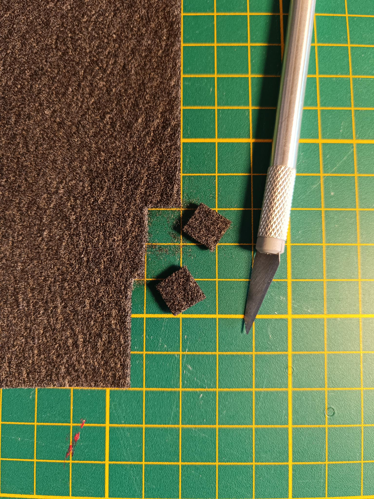

<!-- There should be only one Header per page. You do not need to use all the keys -->
# Fabricating components

| Detail        | Value                       |
|---------------|-----------------------------|
| Time Required | None      |
| Skills        | 3D printing or milling, Drilling, Cutting      |

## Bill of Materials

### Parts 

* a small plate of [1 mm copper sheet]{: Class="bom"} 
* 4 cm² of [conductive felt]{: Class="bom"} 
* 160 cm² of [gasket sheet]{: Class="bom"}    - Dimensions must be at least enough to cut out approx. four 6 cm x 8 cm rectangles, an A4 sheet is enough
* 100 cm² of [grafoil]{: Class="bom"} 
* 2 [peristaltic pumps]{: Class="missing"} 
* some [polypropylene filament]{: Class="missing"}    - This can be substituted if you only plan to run water through the cell for testing things other than the chemistry
* A4 sheet [separator sheet]{: Class="bom"} 
* some [stiff filament]{: Class="missing"}    - PLA works
* 44 cm of [tubing]{: Class="bom"} 

### Tools 

* 1 [FDM printer]{: Class="missing"} 
* 1 [gasket cutter machine]{: Class="missing"}    - Vinyl/laser cutter or hand tools
* 1 [utility knife]{: Class="missing"} 

You will need a [FDM printer]{: Class="missing"} and at least two types of filament, [stiff filament]{: Class="missing"} and [polypropylene filament]{: Class="missing"}.

## Step 1: Print one jig and one cell assembly tool {:id="print-one-jig-and-one-cell-assembly-tool" class="page-step"}

Print the jig and cell assembly tool in PLA or whatever material you can print easily. It does not have to be chemically resistant or that strong, so you can use a low infill.

## Step 2: Print two endplates {:id="print-two-endplates" class="page-step"}

These endplates must be stiff, so print them with at least 60% infill. Try to avoid warping as they bottom need to be flat to seal the cell well.

## Step 3: Print wetted cell components in polypropylene {:id="print-wetted-cell-components-in-polypropylene" class="page-step"}
 
Print two reservoirs, two flow frames, and one membrane frame

It's important these don't leak, so print them at 100% infill with 5 perimeters.

> **Warning** 
> 
> The total combined thickess of the flow frames and (compressed) gaskets is important! There are multiple thickness options in the `flow-frames` folder and custom thicknesses can be genererated from the FreeCAD files. The graphite felt should be compressed to 70% of it's original thickness. The compression is fixed by the combined total thickness of the flow frame and two gaskets.

## Step 4: Cut gaskets {:id="cut-gaskets" class="page-step"}

> **Note:**
> 
> Cutting the gaskets is most easily done with a vinyl cutter machine or laser cutter, but can also be done manually with a steady hand, utility blade, and appropriately sized punches.

1. Using a [gasket cutter machine]{: Class="missing"}, download the gasket file and cut a sheet of [gasket material][gasket sheet] to make the following four gaskets:

This makes two inner gaskets and two outer gaskets.

## Step 5: Cut porous electrodes {:id="cut-porous-electrodes" class="page-step"}

Cut two conductive graphite felt electrodes to fit inside the flow frames using scissors or a [utility knife]{: Class="missing"}. Our current standard test uses 2 cm² geometric area cells, so cut two squares each with a side length of 14.1 mm from a larger piece of [conductive felt].

This makes two cut electrodes.

## Step 6: Cut separator membrane {:id="cut-separator-membrane" class="page-step"}

Cut [separator sheet] into four 3 cm x 3 cm squares

This produces four cut membranes

## Step 7: Cut grafoil current collectors {:id="cut-grafoil-current-collectors" class="page-step"}

Using a precut gasket as a guide, cut [grafoil] into the following shape to make grafoil current collectors.

## Step 8: Cut copper current collectors {:id="cut-copper-current-collectors" class="page-step"}

Using a router or a drill (press), cut some [1 mm copper sheet] according to the below drawing to make two copper current collectors.

## Cut tubing

Cut [tubing] into 2x 17 cm and 2x 5 cm pieces. Load the long pieces into the [peristaltic pumps]{: Class="missing"} as shown:

This makes cut tubing pieces.
[FDM printer]:missing.md ""
[stiff filament]:missing.md ""
[polypropylene filament]:missing.md ""
[gasket cutter machine]:missing.md ""
[gasket sheet]:gaskets.md ""
[utility knife]:missing.md ""
[conductive felt]:conductive_felt.md ""
[separator sheet]:separator_sheet.md ""
[grafoil]:grafoil.md ""
[1 mm copper sheet]:copper.md ""
[tubing]:tubing.md ""
[peristaltic pumps]:missing.md ""

<!-- GitBuilding Nav -->
---

[Previous page](index_BOM.md) | [Next page](electronics.md)