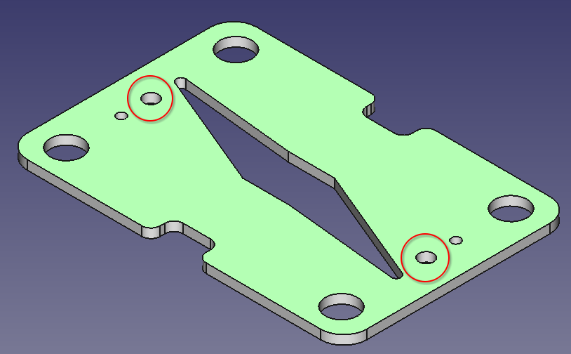

---
Details:
    Thumbnail: images/<Your Image>.jpg
    Time: Hours
    Difficulty: Hard
    Skills:
      - 3D printing or milling
      - Drilling
      - Cutting

---
<!-- There should be only one Header per page. You do not need to use all the keys -->

# Fabricating cell components
## Bill of Materials

{{BOM}}

## Print rigid cell components  {pagestep}

Using a [3D printer](3D_printer.md){qty:1, cat:tool} loaded with chemically compatible polypropylen filament/epoxy resin [3D printing feedstock](3D_printing_feedstock.md){qty: 200 g}, print one [cell body with four barbed fittings](../exports/Cell Body with Four Barbed Fittings.3mf), one [backing plate](../exports/Backing Plate.3mf) and two [flow frames](../exports/Flow Frame.3mf) (links are to .3mf files).

>i **Prefer conventional machining?**
>i 
>i You can also fabricate these parts by milling them from a larger sheet of polypropylene

## Post-process printed parts  {pagestep}
1. Remove brim, raft, support material from print (depending on printing method)
* Sand down, with fine-grit [sandpaper]{qty:1 sheet, cat:tool}:
> 1. The sealing faces of each cell body
> 
> * Both faces of each flow frame
> 
* Secure each cell body and flow frame in a [vise]{qty: 1, cat:tool} and drill out the alignment pin holes to their final diameter with a [drill]{qty: 1, cat:tool, note:"A hand drill or rotary tool (with steady hands) works, but a drill press is preferable"} and an [1/8" drill bit]{qty: 1, cat: tool}
> 
> 
> 
>! **Caution**
>! 
>! Depending on the dimensional accuracy of your printed parts, you may need to additionally drill out the electrolyte inlet/outlet holes to the correct diameter with an appropriately sized drill bit (these inlet/outlet holes are located immediately on either side of the alignment pin holes)

This will produce one [cell body with four barbed fittings]{output, qty:1}, one [backing plate]{output, qty:1} and two [flow frames]{output, qty: 2}.

## Cut gaskets {pagestep}

>i **Note:**
>i
>i Cutting the gaskets is most easily done with a vinyl cutter machine, but can also be done manually with a steady hand, utility blade, and appropriately sized punches.

1. Using a [vinyl cutter machine]{qty: 1, cat:tool}, cut a sheet of [gasket material][gasket sheet](gaskets.md){qty: 160 cm², note: "Dimensions must be at least enough to cut out approx. four 6 cm x 8 cm rectangles, an A4 sheet is enough" } to make:
>* one [pass-through gasket](../exports/Pass-Through Gasket.svg)
>
> 
>
>* three [blocking gaskets](../exports/Blocking Gasket.svg)
>
> 

 This will produce one [pass-through gasket]{output, qty: 1} and three [blocking gaskets]{output, qty: 3}.

## Cut alignment pins {pagestep}
Using a [tubing cutter]{qty:1, cat:tool, Note:"Anything capable of producing a clean, square cut on plastic tubing withing deforming the tube"}, cut two pieces of [1/8" outside diameter hard plastic tubing]{qty: 10 cm, Note: "1/8 inch OD PTFE tubing works well"} into 5 cm lengths.

This will produce two [alignment pins]{output, qty:2}, which should fit smoothly in to the alignment pin holes in the cell bodies.

## Cut porous carbon electrodes {pagestep}

TODO

Cut two carbon electrodes into 10 mm x 10 mm square
## Cut separator membrane {pagestep}

TODO

Cut one piece of separator membrane material into a 20 mm x 20 mm square

## Cut grafoil sheets {pagestep}

Cut [grafoil](grafoil.md){qty: 100 cm²} into two 5 cm by 5 cm squares.

## Cut silicone tubing

Cut [silicone tubing](tubing.md){qty: 1 meter} into 6 15 centimeter pieces.
