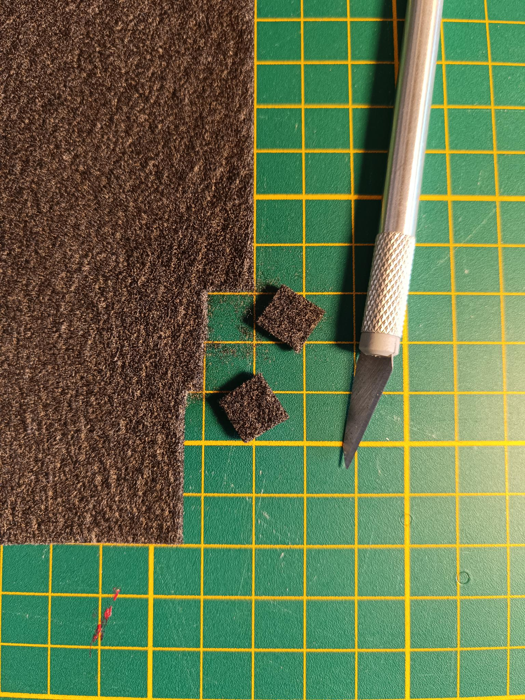

---
Details:
    Time: Hours
    Skills:
      - 3D printing or milling
      - Drilling
      - Cutting

---
<!-- There should be only one Header per page. You do not need to use all the keys -->
# Fabricating components

## Bill of Materials

{{BOM}}

You will need a [FDM printer]{qty:1, cat:tool} and at least two types of filament, [stiff filament]{qty: some, Note: PLA works} and [polypropylene filament]{qty: some, Note: This can be substituted if you only plan to run water through the cell for testing things other than the chemistry}.

## Print one jig and one cell assembly tool{pagestep}

Print the [jig]{output, qty: 1} and [cell assembly tool]{output, qty: 1} in PLA or whatever material you can print easily. It does not have to be chemically resistant or that strong, so you can use a low infill.

{color: white}

{color: white}

## Print Arduino Uno case parts{pagestep}

These parts can be done in PLA or similar filaments at low infill. They mount onto the back of the jig.

{color: white}
{color: white}
{color: white}

>i **Note** 
>i
>i [3D Printed Case for Arduino Uno, Leonardo](https://github.com/zygmuntw/3D-Printed-Case-for-Arduino) by ZygmuntW is licensed under the Creative Commons - Attribution - Share Alike license.

## Print two endplates{pagestep}

Print one of each endplate: [endplate with holes]{output, qty: 1} and [endplate with pins]{output, qty: 1}. They must be stiff, so print them with at least 70% infill in PLA or PETG. Try to avoid warping as they bottom need to be flat to seal the cell well.

{color: white}

{color: white}

## Print wetted cell components in polypropylene{pagestep}
 
Print the [combined reservoir]{output, qty: 1} and two [flow frames]{output, qty: 2} **in polypropylene**.

It's important these don't leak. Leak-tight parts in FDM require trial-and-error, we have found good conditions for printing to be at 100% infill, 7 perimeters/wall lines, 1.05 flowrate multiplier (5% overextrusion), and a line width of 0.45 mm (for a 0.4 mm nozzle).

>? **Help Block** 
>?
>? It's important these don't leak. Leak-tight parts in FDM require trial-and-error, we have found good conditions for printing to be at 100% infill, 7 perimeters/wall lines, 1.05 flowrate multiplier (5% overextrusion), and a line width of 0.45 mm (for a 0.4 mm nozzle).

{color: black}

{color: black}

>!! **Warning** 
>!!
>!! The total combined thickess of the flow frames and (compressed) gaskets is important! The compression is fixed by the combined total thickness of the flow frame and two gaskets.

## Cut gaskets {pagestep}

>i **Note:**
>i
>i Cutting the gaskets is most easily done with a vinyl cutter machine or laser cutter, but can also be done manually with a steady hand, utility blade, and appropriately sized punches.

Using a [gasket cutter machine]{qty: 1, cat:tool, Note: Vinyl/laser cutter or hand tools}, download the gasket file and cut a sheet of [gasket material][gasket sheet](gaskets.md){qty: 160 cm², note: "Dimensions must be at least enough to cut out approx. four 6 cm x 8 cm rectangles, an A4 sheet is enough" } to make the following four gaskets:

[inner gaskets]{output, qty: 2, hidden} [outer gaskets]{output, qty: 2, hidden}

## Cut porous electrodes {pagestep}

Cut two conductive graphite felt electrodes to fit inside the flow frames using scissors or a [utility knife]{qty: 1, cat:tool}. Our current standard test uses 2 cm² geometric area cells, so cut two squares each with a side length of 14.1 mm from a larger piece of [conductive felt](conductive_felt.md){qty: 4 cm², cat: part}.

[cut electrodes]{output, qty: 2, hidden}

## Cut separator membrane {pagestep}

Cut [separator sheet](separator_sheet.md){qty: A4 sheet,cat: part} into a 2.7 cm x 2.7 cm square (depending on your material, you may need multiple layers to stack to sufficient thickness).

[cut membrane]{output, qty: 1, hidden}

## Cut grafoil current collectors {pagestep}

Using a precut gasket as a guide, cut/punch [grafoil](grafoil.md){qty: 100 cm²} into the following shape to make [grafoil current collectors]{output, qty: 2}. An appropriate gasket cutter machine can also be used but note that a CO₂ laser cannot cut graphite.

## Cut brass current collectors {pagestep}

Using a [2D metal cutting tool]{qty: 1, cat:tool,Note: "Mill, drill, router, laser cutter for sheet metal"}, machine [1 mm brass sheet](brass.md){qty: a small plate of} according to the below drawing to make two [brass current collectors]{output, qty: 2}. Alternatively [the .step file](../CAD/exports/Current-Collector.step) can be used with 2D fabrication services to order the cut parts.

## Ensure correct tubing type is in peristaltic pumps {pagestep}

If you plan to test zinc-iodide chemistries, you need PTFE-lined peristaltic pump tubing loaded in your [peristaltic pumps](pumps.md){qty: 2} [peristaltic pumps with correct tubing]{output, qty:2, hidden}

>!! **Warning** 
>!!
>!! Your pump may not come with PTFE-lined tubing installed, you should verify what type is installed before running your first experiment

## Cut tubing {pagestep}

Cut [tubing](tubing.md){qty: 54 cm} into the following lengths:

- 4x 3.5 cm pieces (flow frame connections to Luer Lock fittings)
- 2x 4 cm (pump to flow frame Luer Lock fitting)
- 2x 7 cm pieces (pump outlet to reservoir inlet)
- 2x 9 cm pieces (reservoir outlet to flow frame Luer Lock fitting)

>? **Help Block** 
>?
>? The tubing-printed barb connections are difficult to attach, the fit is very tight. Softening the ends of the tubing in hot water before pushing them on can help immensely.

## Attach tubing to the barbed fittings {pagestep}

Take the two flow frames and attach one piece of 3.5 cm tubing to each barb. It should be a tight fit. You will only have to do this once.

Then, insert [F-25 Luer Lock Adapters]{cat: part, qty: 4} Into the ends of the tubing.

[flow frames with tubing and adapters]{output, qty: 2, hidden}

## Attach tubing to the reservoirs {pagestep}

## Attach banana connectors to the outer current collectors {pagestep}

Take two [2mm banana connectors with M2 thread and matching nuts]{cat: part, qty: 2} and fasten them to the outer current collectors as shown above.

>!! **Warning** 
>!!
>!! Be sure to make mirrored left- and right-handed versions of the current collectors with the connectors installed. In the assembled cells, the tabs must be opposite each other but the elecrical connections are done from the same side.

[outer current collectors with banana connector]{output, qty: 2, hidden}

