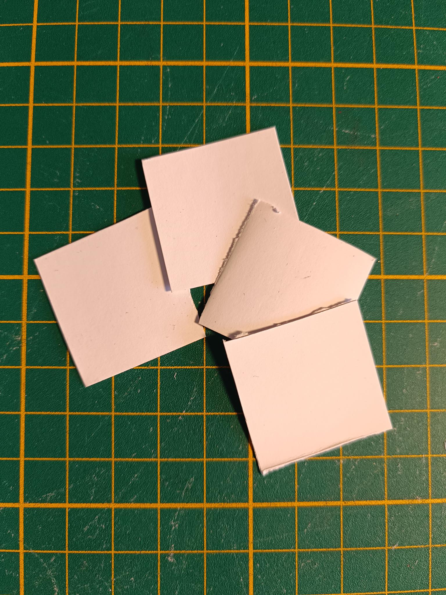

---
Details:
    Thumbnail: images/printing.png
    Time: Hours
    Skills:
      - 3D printing or milling
      - Drilling
      - Cutting

---
<!-- There should be only one Header per page. You do not need to use all the keys -->
# Fabricating components

## Bill of Materials

{{BOM}}

## Fabricate endplate {pagestep}

These are preferably milled from solid aluminum with a [3-axis mill]{qty: 1, cat: tool}. The .STEP file of the below part is found [here](../CAD/exports/Metal Endplate.step), this is exported from the `flow_cell.FCStd` file.

An experimental endplate that can be FDM-printed is also included. Recommendations are for a stiff, rigid filament with >=70% infill and a concentric infill pattern and skirt to avoid warping.

This makes two [endplates]{output, qty: 2}.

## Print rigid cell components  {pagestep}

Using a [3D printer]{qty:1, cat:tool} loaded with chemically compatible polypropylene filament [3D printing feedstock]{qty: 200 g}, print two [reservoirs]{output, qty: 2} and two [flow frames]{output, qty: 2}.

Print the [jig]{output, qty: 1}  in PLA or whatever material you can print easily. It does not have to be chemically resistant.

>!! **Warning** 
>!!
>!! The total combined thickess of the flow frames and (compressed) gaskets is important! There are multiple thickness options in the `flow-frames` folder and custom thicknesses can be genererated from the FreeCAD files. The graphite felt should be compressed to 70% of it's original thickness. The compression is fixed by the combined total thickness of the flow frame and two gaskets.

>i **Prefer conventional machining?**
>i 
>i You could also fabricate the flow frames parts by milling/laser cutting them from a sheet of polypropylene.

## Post-process printed parts  {pagestep}
Remove brim, raft, support material from print (depending on printing method)

Sand down, with fine-grit [sandpaper]{qty:1 sheet, cat:tool}, both faces of each flow frame.

## Cut gaskets {pagestep}

>i **Note:**
>i
>i Cutting the gaskets is most easily done with a vinyl cutter machine, but can also be done manually with a steady hand, utility blade, and appropriately sized punches.

1. Using a [vinyl cutter machine]{qty: 1, cat:tool, Note: or laser cutter or hand tools}, download the gasket file (as [svg](../CAD/exports/1 sqcm gaskets.svg), [dxf](../CAD/exports/1 sqcm gaskets.dxf), or [pdf](../CAD/exports/1 sqcm gaskets.pdf)) and cut a sheet of [gasket material][gasket sheet](gaskets.md){qty: 160 cm², note: "Dimensions must be at least enough to cut out approx. four 6 cm x 8 cm rectangles, an A4 sheet is enough" } to make the following four gaskets:

 This makes two [pass-through gaskets]{output, qty: 2} and two [blocking gaskets]{output, qty: 2}.

## Cut porous electrodes {pagestep}

Cut two conductive graphite felt electrodes to fit inside the flow frames using scissors or a [utility knife]{qty: 1, cat:tool}. Our current standard test uses 2 cm² geometric area cells, so cut two squares each with a side length of 14.1 mm from a larger piece of [conductive felt](conductive_felt.md){qty: 4 cm², cat: part}.

This makes two [cut electrodes]{output, qty: 2}.

## Cut separator membrane {pagestep}

Cut [separator sheet](separator_sheet.md){qty: A4 sheet,cat: part} into four 3 cm x 3 cm squares

This produces four [cut membranes]{output, qty: 4}

## Cut grafoil current collectors {pagestep}

Using a precut gasket as a guide, cut [grafoil](grafoil.md){qty: 100 cm²} into the following shape to make [grafoil current collectors]{output, qty: 2}.

## Cut copper current collectors {pagestep}

Cut [copper sheet](copper.md){qty: 50 cm²} into two 5 cm by 5 cm squares to make [copper current collectors]{output, qty: 2}.

>!! **Warning to prevent leakage** 
>!!
>!! Make sure at least one orientation of the copper squares fits *exactly* the machined square recess in the cell bodies 

## Cut tubing

Cut [tubing](tubing.md){qty: 44 cm} into 2x 17 cm and 2x 5 cm pieces. Load the long pieces into the peristaltic pumps as shown:

This makes [cut tubing pieces]{output, qty: 4}.
