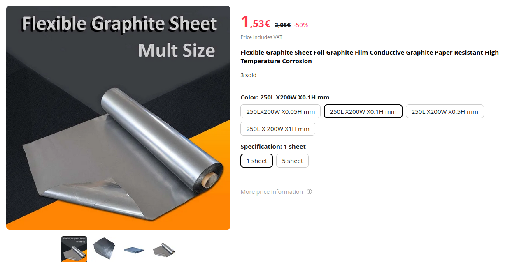

---
PartData:
    Specs:
        Thickness: TODO
    Suppliers:
         AliExpress:
            PartNo: Use this link
            Link: 'https://www.aliexpress.com/item/1005005662210405.html'
         RS Components:
            PartNo: 268-6953
            Link: https://uk.rs-online.com/web/p/gasket-sheets/2686953
---

## Grafoil sheet

Grafoil sheet is compressed graphite commonly used in industry as high-temperature gasket material. It is affordable and similar enough for our purpose here to bipolar plate material, which is much harder to source.

